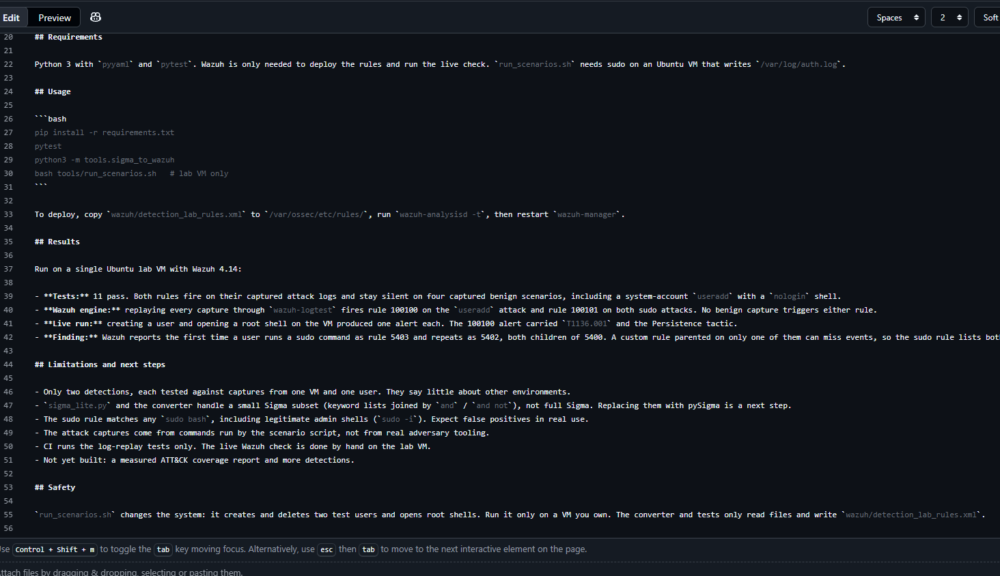

# Detection Lab


Detection-as-code for a Wazuh home lab: Sigma rules tested by replaying real attack logs, converted to Wazuh rules, and checked against a live Wazuh instance.

**Status:** work in progress. Six detections covering five ATT&CK techniques. Five are confirmed firing in Wazuh; one has an open issue (see Results).

## Detections

| Detection | Technique | Wazuh id | Wazuh parent rule |
|-----------|-----------|----------|-------------------|
| New local user (`useradd`) | T1136.001 | 115101 | 5902 |
| Root shell via sudo | T1548.003 | 115102 | 5402, 5403 |
| User added to the sudo group (`usermod`) | T1098 | 115103 | none (matches program name) |
| SSH login for a non-existent user | T1110.001 | 115104 | 5710 |
| Repeated failed sudo passwords | T1110.001 | 115105 | 5401 |
| User account deleted (`userdel`) | T1531 | 115106 | 5903 |



## Components

| File | What it does |
|------|--------------|
| `rules/*.yml` | One Sigma rule per detection, tagged with an ATT&CK technique. |
| `tools/sigma_lite.py` | Loads and validates rules and matches them against log lines. Supports only the Sigma keyword subset these rules use. |
| `tools/sigma_to_wazuh.py` | Converts each Sigma rule into a Wazuh rule with a PCRE2 regex and ATT&CK tags, using `tools/wazuh_map.yml` for rule ids and parent rules. |
| `tools/coverage_report.py` | Re-checks every rule against the captured logs and writes `docs/coverage.md` and an ATT&CK Navigator layer. |
| `tools/run_scenarios.sh` | Runs attack and benign commands on the lab VM and saves the `auth.log` lines each one produces to `tests/captured/`. |
| `wazuh/detection_lab_rules.xml` | The generated Wazuh rules file. Do not edit by hand. |
| `tests/` | Checks that rules are valid, fire on captured attack logs, stay silent on captured benign logs, and that the generated Wazuh and coverage files are current. |

## Requirements

Python 3 with `pyyaml` and `pytest`. Wazuh is only needed to deploy the rules and run the live check. `run_scenarios.sh` needs sudo on an Ubuntu VM that writes `/var/log/auth.log`. The SSH scenarios assume `sshd` listens on port 2200 (edit the `SSH=` line in the script for another port).

## Usage

```bash
pip install -r requirements.txt
pytest
python3 -m tools.sigma_to_wazuh
python3 -m tools.coverage_report
bash tools/run_scenarios.sh   # lab VM only
```

To deploy, copy `wazuh/detection_lab_rules.xml` to `/var/ossec/etc/rules/`, run `wazuh-analysisd -t` and check for duplicate-id warnings, then restart `wazuh-manager`.

## Results

Run on a single Ubuntu lab VM with Wazuh 4.14:

- **Tests:** 30 pass. Every rule fires on its captured attack logs and stays silent on seven captured benign scenarios, including a system-account `useradd`, a `usermod` to an ordinary group, a failed SSH login for a valid user, and a single mistyped sudo password.
- **Wazuh engine:** replaying every capture through `wazuh-logtest` fires five of the six rules on their attack captures. No benign capture triggers any rule.
- **Live run:** performing each attack on the VM produced one alert for each of those five rules.
- **Open issue:** the repeated-failed-sudo rule (115105) passes the Python tests but does not fire in `wazuh-logtest`. The cause is not yet found.
- **Finding, sudo:** Wazuh reports the first time a user runs a sudo command as rule 5403 and repeats as 5402, both children of 5400. A custom rule parented on only one of them can miss events, so the root-shell rule lists both.
- **Finding, usermod:** Wazuh has no built-in rule for `usermod` group changes, so that rule matches on the program name.
- **Finding, rule ids:** the custom ids I first chose collided with rules already in `local_rules.xml`. Wazuh printed a duplicate-id warning but still reported `CONFIG OK`, and the config test alone would not have caught it. The rules now use the 115100 range.
- **Coverage:** `docs/coverage.md` lists the five techniques with a passing replay test. "Verified" there means the replay tests pass, not that the rule is confirmed in Wazuh.

## Limitations and next steps

- Six detections tested against captures from one VM and one user. They say little about other environments.
- Wazuh already ships rules for three of these events (5710, 5401, 5903). These rules add Sigma sourcing, tests, and ATT&CK tags, not new alerts.
- `sigma_lite.py` and the converter handle a small Sigma subset (keyword lists joined by `and` / `and not`), not full Sigma. Replacing them with pySigma is a next step.
- The root-shell rule matches any `sudo bash`, including legitimate admin shells (`sudo -i`). Expect false positives in real use.
- One invalid SSH username is a loose fit for brute force (T1110.001), and account deletion is a loose fit for T1531. A threshold rule would suit the first better, but the converter does not support thresholds.
- The sudo-group rule only covers `usermod`. Other ways to gain sudo rights, such as `gpasswd` or editing `/etc/group`, are not tested.
- The attack captures come from commands run by the scenario script, not from real adversary tooling.
- The SSH scenarios depend on `sshd` on port 2200 with password logins off. That setup is specific to this VM.
- CI runs the log-replay tests only. The live Wazuh check is done by hand on the lab VM.
- Next: fix the failed-sudo rule in Wazuh, then add more detections.

## Safety

`run_scenarios.sh` changes the system: it creates and deletes test users, opens root shells, and makes failed SSH and sudo attempts. Run it only on a VM you own, and turn off SSH password logins on that VM first. The converter and tests only read files and write generated files under `wazuh/` and `docs/`.
